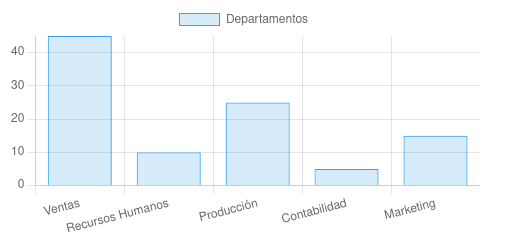
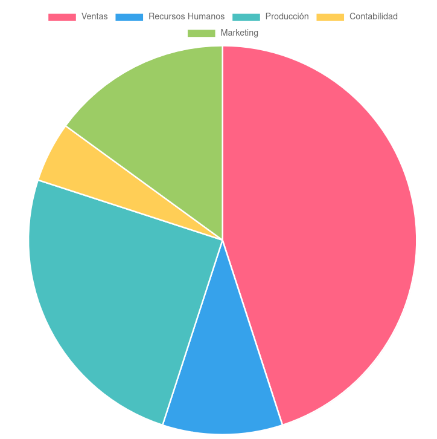

# Análisis descriptivo de datos. Regresión.

El objetivo es extraer y presentar información a partir de un conjunto de datos mediante tablas, gráficas y descriptores numéricos, es decir, conjunto de técnicas orientadas a la descripción numérica de un conjunto de individuos.

Si seleccionamos a una empresa y vemos todos los servicios que ofrece, estos servicios los podríamos describir con parámetros y si seleccionamos un conjunto de servicios (muestra), los describiríamos con datos estadísticos.

| Servicio        | Parámetro 1 | Parámetro 2 | Parámetro 3 |
|-----------------|-------------|-------------|-------------|
| Servicio 1      | Valor 1     | Valor 2     | Valor 3     |
| Servicio 2      | Valor 4     | Valor 5     | Valor 6     |
| Servicio 3      | Valor 7     | Valor 8     | Valor 9     |
| Servicio 4      | Valor 10    | Valor 11    | Valor 12    |

### Tipos de variables

Una variable es la característica de la muestra o servicio que se esta observando y que vería entre los diferencies datos obtenidos del estudio.

* **Cualitativas** No son medibles numéricamente. Ej: El sexo, estado civil, satisfacción del cliente, calidad del servicio, etc.

Dentro de estas podemos distinguir dos tipos:

  * **Nominales** No existe ordenación entre sus valores. Ej: Departamentos, tipos de producto/servicio

  * **Ordinales** Existe una ordenación de sus valores. Ej: Nivel de satisfacción del empleado, calidad del equipo de trabajo, etc.

* **Cuantitativas** Son medibles numéricamente. Ej: La edad, número de servicios, altura, distancias, etc.

Dentro de estas podemos distinguir dos tipos:

  * **Discretas** Tienen una cantidad finita de valores. Ej: Número de departamentos, cantidad de productos defectuosos, horas de formación impartida a empleados, etc.

  * **Continuas** Tienen una cantidad no-finita de valores. Ej: Ingresos mensuales, temperatura de los servidores en la empresa, tiempo de procesamiento de una orden/petición de un cliente, etc.

## Tabla de frecuencias.

Representa el número o fracción de veces que aparece cada posible valor de la variable.

> Tabla de frecuencia de la distribución de los recursos económicos de una empresa.

| Departamento        | Ventas | Recursos Humanos | Producción | Contabilidad | Marketing |
|---------------------|--------|------------------|------------|--------------|-----------|
| Frec. Absoluta      | 45     | 10               | 25         | 5            | 15        |
| F.A. Acumulada      | 45     | 55               | 80         | 85           | 100       |
| Frec. Relativa      | 0.45   | 0.10             | 0.25       | 0.05         | 0.15      |
| F.R. Acumulada      | 0.45   | 0.55             | 0.80       | 0.85         | 1         |

**Frecuencia Absoluta (Frec. Absoluta)** Es el número todal de observacions que pertenece a una categoria específica, en este caso representa la cantida de recursos económicos en base a un todal de 100 que se destina a cada departamente.

**Frecuencia Absoluta Acumulada (F.A Acumulada)** Es la suma actual de las frecuencias absolutas hasta cierto punto de la distribución.

**Frecuencia Relativa (Frec. Relativa)** Es la porcion de observaciones en una categoria especifica en relacion al numero de observaciones, o en este caso a la cantidad de recursos económicos.

**Frecuenca Relativa Acumulada (F.R. Acumulada)** Es la suma actual de las frecuencias relativas hasta cierto punto de la distribución.

> NOTA: Siempre el ultimo valor de las F.A Acumuladas y F.A Relativas tiene que ser 100 y 1, respectivamente.

Las variables se denotan con letras mayúsculas **$X$**, **$Y$** etc., y sus valores por letras minúsculas **$x$**, **$y$** ...

La frecuencia absoluta de un valor **$x_i$** se denota por **$n_i$**, y la acumulada por **$N_i$**.

La frecuencia relativa se escribe **$f_i$**, y la acumulada **$F_i$**.

Las F.A. Acumuladas y las F.R. Acumulada proporcionan una visión global de la distribución de los datos, lo que facilita la comprensión de la distribución total de las observaciones y proporciones en una tabla de frecuencias.

## Representaciones gráficas.

Presentan de forma fiable y rápida la información contenida en un conjunto de datos. Estos datos se tiene que representar de una forma correcta ya que pueden transmitir información errónea o pueden manipular a los usuarios.

### Diagrama de Barras

Muestra un rectángulo por cada valor de la variable, con altura igual a su frecuencia.

### Diagrama de Sectores

Muestra un círculo con un sector por cada valor de ángulo proporcional a su frecuencia.

## Características de una variable estadística.

### Media Aritmética

La media aritmética $\bar{x}$ es la suma de todos los valores de la distribución dividida por el número total de datos:

$$\bar{x} = \frac{\sum_{k=1}^n x_i}{N} $$

$$\bar{x} = \sum_{k=1}^n \frac{x_i * n_i}{N} $$

| Departamento (**$x_i$**)   | Ventas (5 secciones) | Recursos Humanos (2 secciones) | Producción (3 secciones) | Contabilidad (1 secciones) | Marketing (3 secciones) |
|----------------------------|----------------------|--------------------------------|--------------------------|----------------------------|-------------------------|
| Frec. Absoluta (**$n_i$**) | 45                   | 10                             | 25                       | 5                          | 15                      |

$\bar{x} = \sum_{k=1}^n \frac{x_i * n_i}{N} $ => $$\bar{x} = \frac{(5*45)+(2*10)+(3*25)+(1*5)+(3*15)}{45+10+25+5+15} $$ => $$\bar{x} = \frac{370}{100}$$ => $$\bar{x} = 3,75$$

La media artimética tiene ventajas y desventajas, entre las ventajas podemos destacar que tiene en cuenta todos los valroes de la distribución, es facil de calcular y es única. En cambio las desventajas son que tiende a equilibrar valores, es sensible a valores externos como subidas y bajadas, poco representativa cuando hay mucha dispersion de los datos.

### Moda

La moda es aquel valor de la variable que más veces se repite

* Si la distribución es NO agrupada en intervalos, se observa la columna de frecuencias absolutas y el valor de la distribución al que corresponde la mayor frecuencia será la moda (no tiene por qué ser única)

* Si la distribución es agrupada en intervalos, simplemente damos el intervalo de mayor frecuencia

| $x_i$ | 0 | 1 | 2 | 3 |
|-------|---|---|---|---|
| $n_i$ | 0 | 1 | 2 | 3 |

En este caso la moda es 2

> Siempre nos fijaremos en $n_i$, si la distribución esta agrupada en intervalos, claro está.

### Mediana

En una distribución de frecuencias ordenada de menor a mayor, la mediana es aquel valor de la distribución que deja a su izquierda y a su derecha la misma proporcion de valors de la distribución.

Si hay un número impar de valores, es aquel que ocupa lo posición central:

0 0 1 2 3 3 3 3 4 5 5 -> Mediana = 3

Si hay un número par de valores, es la media aritmética de lso dos valores centrales:

0 0 1 2 3 4 4 5 6 6 -> Mediana = 3.5

> Siempre nos fijaremos en $n_i$, si la distribución esta agrupada en intervalos, claro está.

### Cuantiles

## Variables estadísticas bidimensionales y distribuciones de frecuencias. Independencia.

## Regresión lineal y correlación.

