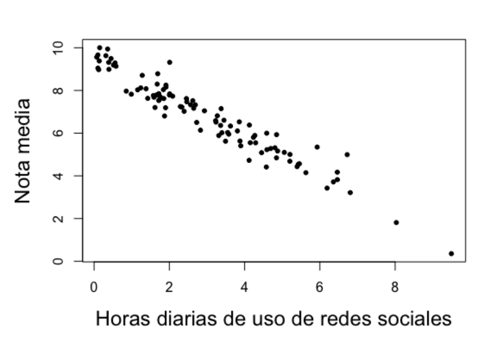
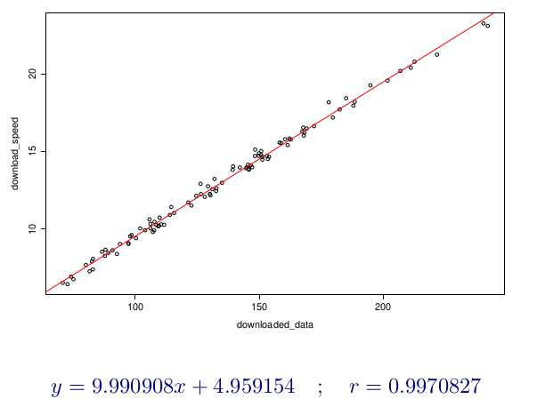
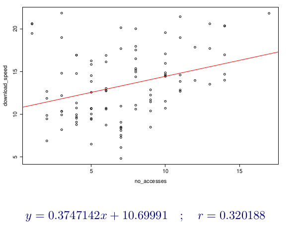

# Análisis descriptivo de datos. Regresión.

El objetivo es extraer y presentar información a partir de un conjunto de datos mediante tablas, gráficas y descriptores numéricos, es decir, conjunto de técnicas orientadas a la descripción numérica de un conjunto de individuos.

Si seleccionamos a una empresa y vemos todos los servicios que ofrece, estos servicios los podríamos describir con parámetros y si seleccionamos un conjunto de servicios (muestra), los describiríamos con datos estadísticos.

| Servicio        | Parámetro 1 | Parámetro 2 | Parámetro 3 |
|-----------------|-------------|-------------|-------------|
| Servicio 1      | Valor 1     | Valor 2     | Valor 3     |
| Servicio 2      | Valor 4     | Valor 5     | Valor 6     |
| Servicio 3      | Valor 7     | Valor 8     | Valor 9     |
| Servicio 4      | Valor 10    | Valor 11    | Valor 12    |

### Tipos de variables

Una variable es la característica de la muestra o servicio que se esta observando y que vería entre los diferencies datos obtenidos del estudio.

* **Cualitativas** No son medibles numéricamente. Ej: El sexo, estado civil, satisfacción del cliente, calidad del servicio, etc.

Dentro de estas podemos distinguir dos tipos:

  * **Nominales** No existe ordenación entre sus valores. Ej: Departamentos, tipos de producto/servicio

  * **Ordinales** Existe una ordenación de sus valores. Ej: Nivel de satisfacción del empleado, calidad del equipo de trabajo, etc.

* **Cuantitativas** Son medibles numéricamente. Ej: La edad, número de servicios, altura, distancias, etc.

Dentro de estas podemos distinguir dos tipos:

  * **Discretas** Tienen una cantidad finita de valores. Ej: Número de departamentos, cantidad de productos defectuosos, horas de formación impartida a empleados, etc.

  * **Continuas** Tienen una cantidad no-finita de valores. Ej: Ingresos mensuales, temperatura de los servidores en la empresa, tiempo de procesamiento de una orden/petición de un cliente, etc.

## Tabla de frecuencias.

Representa el número o fracción de veces que aparece cada posible valor de la variable.

> Tabla de frecuencia de la distribución de los recursos económicos de una empresa.

| Departamento        | Ventas | Recursos Humanos | Producción | Contabilidad | Marketing |
|---------------------|--------|------------------|------------|--------------|-----------|
| Frec. Absoluta      | 45     | 10               | 25         | 5            | 15        |
| F.A. Acumulada      | 45     | 55               | 80         | 85           | 100       |
| Frec. Relativa      | 0.45   | 0.10             | 0.25       | 0.05         | 0.15      |
| F.R. Acumulada      | 0.45   | 0.55             | 0.80       | 0.85         | 1         |

**Frecuencia Absoluta (Frec. Absoluta)** Es el número todal de observacions que pertenece a una categoria específica, en este caso representa la cantida de recursos económicos en base a un todal de 100 que se destina a cada departamente.

**Frecuencia Absoluta Acumulada (F.A Acumulada)** Es la suma actual de las frecuencias absolutas hasta cierto punto de la distribución.

**Frecuencia Relativa (Frec. Relativa)** Es la porción de observaciones en una categoría especifica en relación al numero de observaciones, o en este caso a la cantidad de recursos económicos.

**Frecuenca Relativa Acumulada (F.R. Acumulada)** Es la suma actual de las frecuencias relativas hasta cierto punto de la distribución.

> NOTA: Siempre el ultimo valor de las F.A Acumuladas y F.A Relativas tiene que ser 100 y 1, respectivamente.

Las variables se denotan con letras mayúsculas **$X$**, **$Y$** etc., y sus valores por letras minúsculas **$x$**, **$y$** ...

La frecuencia absoluta de un valor **$x_i$** se denota por **$n_i$**, y la acumulada por **$N_i$**.

La frecuencia relativa se escribe **$f_i$**, y la acumulada **$F_i$**.

Las F.A. Acumuladas y las F.R. Acumulada proporcionan una visión global de la distribución de los datos, lo que facilita la comprensión de la distribución total de las observaciones y proporciones en una tabla de frecuencias.

## Representaciones gráficas.

Presentan de forma fiable y rápida la información contenida en un conjunto de datos. Estos datos se tiene que representar de una forma correcta ya que pueden transmitir información errónea o pueden manipular a los usuarios.

### Diagrama de Barras

Muestra un rectángulo por cada valor de la variable, con altura igual a su frecuencia.

### Diagrama de Sectores

Muestra un círculo con un sector por cada valor de ángulo proporcional a su frecuencia.

## Características de una variable estadística.

### Media Aritmética

La media aritmética $\bar{x}$ es la suma de todos los valores de la distribución dividida por el número total de datos:

$$\bar{x} = \frac{\sum_{k=1}^n x_i}{N} $$

$$\bar{x} = \sum_{k=1}^n \frac{x_i * n_i}{N} $$

| Departamento (**$x_i$**)   | Ventas (5 secciones) | Recursos Humanos (2 secciones) | Producción (3 secciones) | Contabilidad (1 secciones) | Marketing (3 secciones) |
|----------------------------|----------------------|--------------------------------|--------------------------|----------------------------|-------------------------|
| Frec. Absoluta (**$n_i$**) | 45                   | 10                             | 25                       | 5                          | 15                      |

$\bar{x} = \sum_{k=1}^n \frac{x_i * n_i}{N} $ => $$\bar{x} = \frac{(5*45)+(2*10)+(3*25)+(1*5)+(3*15)}{45+10+25+5+15} $$ => $$\bar{x} = \frac{370}{100}$$ => $$\bar{x} = 3,75$$

La media artimética tiene ventajas y desventajas, entre las ventajas podemos destacar que tiene en cuenta todos los valroes de la distribución, es facil de calcular y es única. En cambio las desventajas son que tiende a equilibrar valores, es sensible a valores externos como subidas y bajadas, poco representativa cuando hay mucha dispersion de los datos.

### Moda

La moda es aquel valor de la variable que más veces se repite

* Si la distribución es NO agrupada en intervalos, se observa la columna de frecuencias absolutas y el valor de la distribución al que corresponde la mayor frecuencia será la moda (no tiene por qué ser única)

* Si la distribución es agrupada en intervalos, simplemente damos el intervalo de mayor frecuencia

| $x_i$ | 0 | 1 | 2 | 3 |
|-------|---|---|---|---|
| $n_i$ | 0 | 1 | 2 | 3 |

En este caso la moda es 2

> Siempre nos fijaremos en $n_i$, si la distribución esta agrupada en intervalos, claro está.

### Mediana

En una distribución de frecuencias ordenada de menor a mayor, la mediana es aquel valor de la distribución que deja a su izquierda y a su derecha la misma proporcion de valors de la distribución.

Si hay un número impar de valores, es aquel que ocupa lo posición central:

0 0 1 2 3 3 3 3 4 5 5 -> Mediana = 3

Si hay un número par de valores, es la media aritmética de lso dos valores centrales:

0 0 1 2 3 4 4 5 6 6 -> Mediana = 3.5

> Siempre nos fijaremos en $n_i$, si la distribución esta agrupada en intervalos, claro está.

### Cuantiles

Los cuantiles son valores de la variable que dividen a la distribución en un número determinado de partes iguales, es decir, en intervalos con igual frecuencia.

Existen casso particulares de cuantiles:

* **Cuartiles** Son los 3 valores de la variable ($Q_1$, $Q_2$, $Q_3$) que dividen la distribución en 4 partes iguales, cada una conteniendo el 25% de los valores de la variable.

$$Q_i, i = 1,2,3 => \frac{N * i}{4}$$

* **Deciles** Son los 9 valores de la variable ($D_1$, $D_2$, $D_3$, ..., $D_9$) que dividen la distribución en 10 partes iguales, cada una conteniendo el 10% de los valores de la variable.

$$D_i, i = 1,2,3,...,9 => \frac{N * i}{10}$$

* **Percentiles** Son los 99 valores de la variable ($P_1$, $P_2$, $P_3$, ..., $P_99$) que dividen la distribución en 100 partes iguales.

$$P_i, i = 1,2,3,...,99 => \frac{N * i}{99}$$

Si la posición obtenida con las fórmulas anteriores no es un número entero, elegiremos el dato que se encuentra en la posición que se corresponde con el siguiente número entero.

$$2,3 = 3$$

Si la posición obtenida con las fórmulas anteriores sí es un número entero, el cuantil lo calcularemos como la media del dato contenido en esa posición y el contenido de la posición siguiente

### Medidas de dispersión absolutas

Las medidas de dispersión absolutas son estadísticas que proporcionan información sobre la variabilidad o dispersión de un conjunto de datos sin tener en cuenta la dirección de las desviaciones con respecto a la media. Algunas de las más comunes son:

* **Varianza** Es una medida que nos indica cuánto se alejan los datos de la media. Tenemos que tener en cuenta que la varianza no puede ser negativa, no queda afectada por cambios de origen pero si por cambios de escala.

$$S^2 = \frac{1}{N} \sum_{i=1}^N (x_1 - \bar{x})^2 $$

* **Desviación típica** Nos da una idea de cuánto se dispersan los datos en torno a la media. Una desviación típica mayor indica una mayor dispersión de los datos, mientras que una desviación típica menor indica que los datos están más concentrados alrededor de la media. Se denota como σ (sigma) para poblaciones y ss (minúscula) para muestras. Tenemos que tener en cuenta que la varianza no puede ser negativa, no queda afectada por cambios de origen pero si por cambios de escala.

$$S = \sqrt{S^2} $$

### Medidas de dispersión relativas

Las medidas de dispersión relativas son estadísticas que proporcionan información sobre la variabilidad o dispersión de un conjunto de datos en relación a su tamaño.

* **Coeficiente de Pearson**  Representa el número de veces que $S$ contiene a $\bar{x}$, luego a mayor $V$, menor representatividad de $\bar{x}$

$$V= \frac{S}{\bar{x}}$$

Ejemplo:

## Variables estadísticas bidimensionales y distribuciones de frecuencias. Independencia.

El valor de una variable puede influir sobre otra, al mismo tiempo si no influye y no existe una relacion se puede decir que son independientes y cuando su relacion es perfecta se dice que estan relacionadas funcionalmete o lo que es lo mismo:

$$ y = f(x)$$

| X\Y                        | [0,2] | (2,4] | (4,6] | (6,8] | (8,10] | $n_x$ |
|----------------------------|-------|-------|-------|-------|--------|-------|
| Facebook                   | 8     | 5     | 8     | 3     | 2      | 26    |      
| TikTok                     | 5     | 9     | 3     | 0     | 0      | 17    |
| YouTube                    | 5     | 3     | 5     | 0     | 0      | 13    |
| Pinterest                  | 6     | 7     | 2     | 2     | 0      | 17    |
| Instagram                  | 6     | 1     | 2     | 0     | 0      | 9     |
| X                          | 3     | 6     | 3     | 1     | 0      | 13    |
| Otra                       | 2     | 1     | 0     | 0     | 0      | 3     |
| No estoy en redes sociales | 2     | 0     | 0     | 0     | 0      | 2     |
| $n_y$                      | 37    | 32    | 23    | 6     | 2      | 100   |

### Distribución marginal

La distribución marginal de $Y$ expresa cuantas veces se repite cada valor $y_i$ con independencia de que aparezca conjuntamente con otro valor y otro de $X$

| $Y$                        | [0,2] | (2,4] | (4,6] | (6,8] | (8,10] |
|----------------------------|-------|-------|-------|-------|--------|
| $n_y$                      | 37    | 32    | 23    | 6     | 2      |

La distribución marginal de $X$ expresa cuantas veces se repite cada valor $y_i$ con independencia de que aparezca conjuntamente con otro valor y otro de $Y$

| X\Y                        | $n_x$ |
|----------------------------|-------|
| Facebook                   | 26    |      
| TikTok                     | 17    |
| YouTube                    | 13    |
| Pinterest                  | 17    |
| Instagram                  | 9     |
| X                          | 13    |
| Otra                       | 3     |
| No estoy en redes sociales | 2     |

### Distribución condicionada

La distribución condicional de $X$ dada $Y$ describe cómo se distribuyen los valores de $X$ para cada valor de $Y$.

Distribución de $X$ condicionada a $Y:X\Y$

Distribución de $Y$ condicionada a $X:Y\X$

Ejemplo:

Distribución $X\Y = (2,4]$

| X\Y                        | [0,2] | (2,4] | (4,6] | (6,8] | (8,10] | $X\Y = (2,4]$ |
|----------------------------|-------|-------|-------|-------|--------|---------------|
| Facebook                   | 8     | 5     | 8     | 3     | 2      | 5             |      
| TikTok                     | 5     | 9     | 3     | 0     | 0      | 9             |
| YouTube                    | 5     | 3     | 5     | 0     | 0      | 3             |
| Pinterest                  | 6     | 7     | 2     | 2     | 0      | 7             |
| Instagram                  | 6     | 1     | 2     | 0     | 0      | 1             |
| X                          | 3     | 6     | 3     | 1     | 0      | 6             |
| Otra                       | 2     | 1     | 0     | 0     | 0      | 1             |
| No estoy en redes sociales | 2     | 0     | 0     | 0     | 0      | 0             |
|                            |       |       |       |       |        | 32            |

Distribución $Y\X = TikTok U Facebook$

| X\Y                         | [0,2] | (2,4] | (4,6] | (6,8] | (8,10] |    |
|-----------------------------|-------|-------|-------|-------|--------|----|
| Facebook                    | 8     | 5     | 8     | 3     | 2      |    |      
| TikTok                      | 5     | 9     | 3     | 0     | 0      |    |
| YouTube                     | 5     | 3     | 5     | 0     | 0      |    |
| Pinterest                   | 6     | 7     | 2     | 2     | 0      |    |
| Instagram                   | 6     | 1     | 2     | 0     | 0      |    |
| X                           | 3     | 6     | 3     | 1     | 0      |    |
| Otra                        | 2     | 1     | 0     | 0     | 0      |    |
| No estoy en redes sociales  | 2     | 0     | 0     | 0     | 0      |    |
| $Y\X = TikTok U Facebook$   | 13    | 14    | 12    | 3     | 2      | 44 |

### Independencia estadı́stica

Dos variables $X$ e $Y$ son independientes estadı́sticamente cuando la frecuencia relativa conjunta es igual al producto de las frecuencias relativas marginales:

$$\frac{n_xy}{N} = \frac{n_x}{N} X \frac{n_y}{N} =>$$

$$N X n_xy = n_x X n_y ∀(x , y)$$

Ejemplo A:

$X:$ Número de hermanos
$Y:$ Número de mascotas

¿Son $X$ e $Y$ independientes?

| X\Y   | 0  | 1  | $n_x$ |
|-------|----|----|-------|
| 0     | 30 | 20 | 50    |
| 1     | 18 | 12 | 30    |
| 2     | 6  | 4  | 10    |
| 3     | 6  | 4  | 10    |
| $n_y$ | 60 | 40 | 100   |

$N X n_xy = n_x X n_y ∀(x , y)$

* Par $(x_1, y_1): 100 * 30 = 50 * 60$
* Par $(x_1, y_2): 100 * 20 = 50 * 40$
* Par $(x_2, y_1): 100 * 18 = 30 * 60$
* Par $(x_2, y_2): 100 * 12 = 30 * 40$
* Par $(x_3, y_1): 100 * 6 = 10 * 60$
* Par $(x_3, y_2): 100 * 4 = 10 * 40$
* Par $(x_4, y_1): 100 * 6 = 10 * 60$
* Par $(x_4, y_2): 100 * 4 = 10 * 40$

Si $X$ e $Y$ son independientes.

Ejemplo B:

$X:$ Horas diarias de uso de la red social
$Y:$ Nota media curso

¿Son $X$ e $Y$ independientes?

| X\Y    | (0,5] | (5,7] | (7,9] | (9,10] | $n_x$ |
|--------|-------|-------|-------|--------|-------|
| (0,2]  | 0     | 1     | 24    | 12     | 37    |
| (2,4]  | 0     | 17    | 14    | 1      | 32    |
| (4,6]  | 8     | 15    | 0     | 0      | 23    |
| (6,8]  | 6     | 0     | 0     | 0      | 6     |
| (8,10] | 2     | 0     | 0     | 0      | 2     |
| $n_y$  | 16    | 33    | 38    | 13     | 100   |

$N X n_xy = n_x X n_y ∀(x , y)$

* Par $(x_1, y_1): 100 * 0 = 37 * 16$
* Par $(x_1, y_2): 100 * 1 != 32 * 33$
* No hay necesidad de seguir comprobando

Si $X$ e $Y$ no son independientes.

### Covarianza

La covarianza es una medida estadística que indica el grado de variación conjunta entre dos variables aleatorias. En otras palabras, la covarianza mide cómo cambian dos variables juntas. Si la covarianza es positiva, significa que cuando una variable aumenta, es probable que la otra también aumente. Por el contrario, si la covarianza es negativa, indica que cuando una variable aumenta, es probable que la otra disminuya. Si la covarianza es cercana a cero, las variables están poco correlacionadas.

$$S_xy = \frac{1}{N}\sum_{i=1}^h\sum_{j=1}^kx_iy_j - \bar{x}\bar{y}$$

Ejemplo A:

Supongamos que tenemos una empresa de desarrollo de software que vende dos productos: un software de gestión de proyectos y un software de gestión de recursos humanos. Queremos entender cómo se relacionan las ventas mensuales de estos dos productos.

Para ello, registramos las ventas mensuales de ambos productos durante un año y calculamos la covarianza entre las ventas del software de gestión de proyectos (variable X) y las ventas del software de gestión de recursos humanos (variable Y).

Interpretación:

* Una covarianza positiva significa que cuando las ventas del software de gestión de proyectos aumentan en un mes, es probable que las ventas del software de gestión de recursos humanos también aumenten en ese mismo mes.
    
* Una covarianza negativa implicaría lo contrario: cuando las ventas del software de gestión de proyectos aumentan, las ventas del software de gestión de recursos humanos tienden a disminuir en ese mes.
    
* Una covarianza cercana a cero indicaría que no hay una relación clara entre las ventas de ambos productos en un mes determinado.

Ejemplo B:

Imaginemos una empresa de tecnología que fabrica dispositivos electrónicos, como smartphones y tabletas. La empresa desea analizar la relación entre la cantidad de publicidad en línea que realiza mensualmente (en euros gastados) y la cantidad de unidades de productos vendidos cada mes.

Durante un período de varios meses, la empresa registra el gasto mensual en publicidad en línea y las ventas mensuales de sus productos. Luego, calcula la covarianza entre el gasto en publicidad en línea (variable X) y las ventas de productos (variable Y). Supongamos que la covarianza resultante es positiva, lo que indica una relación creciente entre ambas variables.

Interpretación:

* Una covarianza positiva sugiere que cuando la empresa invierte más en publicidad en línea en un mes determinado, las ventas de productos tienden a aumentar en ese mismo mes.
    
* Esto podría indicar que la publicidad en línea tiene un impacto positivo en las ventas de la empresa.

## Regresión lineal y correlación.

La relación estadística entre variables se refiere al estudio de cómo dos o más variables están relacionadas entre sí. Hay dos conceptos fundamentales para comprender esta relación: correlación y regresión.

La correlación es una medida estadística que indica el grado de dependencia o relación entre dos variables. Se utiliza para determinar si y cómo las variables cambian juntas. Una correlación puede ser positiva, negativa o neutra (cercana a cero).

Coeficiente de correlación lineal:

$$r=\frac{S_xy}{S_x S_y}$$

* Si $-1 <= r < 0$ la correlación lineal es negativa y las rectas de regresión (diferentes) serán decrecientes

* Si $0 < r <= 1$ la correlación lineal es positiva y las rectas de regresión (diferentes) serán crecientes.

* Si $r = 0$ las rectas son paralelas

La regresión es un análisis estadístico que se utiliza para entender la relación entre una variable dependiente (la variable que se quiere predecir) y una o más variables independientes (las variables que se utilizan para predecir). La regresión permite determinar y obtener la estructura de dependencia que mejor exprese el tipo de relación entre las variables.

LLamaremos regresión de $Y$ sobre $X$ a la función que explica la variable $Y$ para cada valor de $X$. La regresion de $X$ sobre $Y$ nos hablará del comportamiento de $X$ para cada valor de $Y$

La recta de regresión de $Y$ sobre $X$:

$$(y - \bar{y}) = \frac{S_xy}{S^2_x}(x - \bar{x})$$

La recta de regresión de $X$ sobre $Y$:

$$(x - \bar{x}) = \frac{S_xy}{S^2_x}(y - \bar{y})$$

Se cortan en el punto $(\bar{x},\bar{y})$

Las pendientes de las rectas tendrán el mismo signo que tenga la covarianza.

* Si $S_xy > 0 =>$ las rectas son crecientes
* Si $S_xy < 0 =>$ las rectas son decrecientes
* Si $S_xy = 0 =>$ las rectas son paralelas a los ejes de coordenadas y perpendiculares entre sí.

### Consideraciones sobre la regresión y la predicción

La predicción de $Y$ para $X = x_0$ será:

$$y_0 =  \bar{y} + \frac{S_xy}{S^2_x}(x_0 - \bar{x})$$

Esta predicción será tanto más fiable cuando mejor sea la correlación lineal entre las varibles, luego una medida aproximada de la bonda de la predicción es $r$ coeficiente de coorrelación lineal-

Ejemplo:

Imagina una empresa de desarrollo de software que está interesada en entender la relación entre el tamaño del equipo de desarrollo y la velocidad de entrega de proyectos de software. La empresa quiere determinar si hay alguna relación entre estas dos variables y cómo pueden utilizar esa información para mejorar su proceso de desarrollo.

**Correlación**:

* La empresa comienza analizando la correlación entre el tamaño del equipo de desarrollo (número de desarrolladores) y la velocidad de entrega de proyectos (medida en la cantidad de funcionalidades implementadas por mes, por ejemplo). Si encuentran una correlación positiva significativa, esto indicaría que a medida que el tamaño del equipo aumenta, la velocidad de entrega tiende a aumentar también. Una correlación negativa sugeriría lo contrario, mientras que una correlación cercana a cero indicaría una relación débil o inexistente.

**Regresión**:

* Después de determinar la correlación, la empresa decide utilizar la regresión para modelar la relación de manera más detallada. Podrían ajustar un modelo de regresión lineal para predecir la velocidad de entrega de proyectos en función del tamaño del equipo de desarrollo. Esto les permitiría obtener una ecuación que relacione estas dos variables y usarla para hacer predicciones sobre la velocidad de entrega esperada para diferentes tamaños de equipo.

