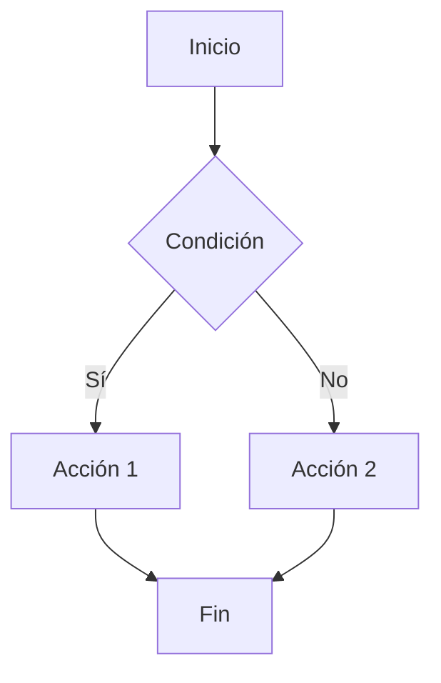

# Introducción

Jekyll es un generador de sitios estáticos muy popular, especialmente útil para blogs técnicos. Con Jekyll y el tema **Chirpy**, podemos crear un blog moderno, rápido y optimizado para GitHub Pages.

---

## Instalación

1. Asegúrate de tener Ruby y Bundler instalados.
2. Clona el **starter** de Chirpy:

```bash
git clone https://github.com/cotes2020/chirpy-starter.git mi-blog
cd mi-blog
bundle install
bundle exec jekyll serve
```

<!-- Block math, keep all blank lines -->

$$
LaTeX_math_expression
$$

<!-- Equation numbering, keep all blank lines  -->

$$
\begin{equation}
  LaTeX_math_expression
  \label{eq:label_name}
\end{equation}
$$

Can be referenced as \eqref{eq:label_name}.

<!-- Inline math in lines, NO blank lines -->

"Lorem ipsum dolor sit amet, $$ LaTeX_math_expression $$ consectetur adipiscing elit."

<!-- Inline math in lists, escape the first `$` -->

1. \$$ LaTeX_math_expression $$
2. \$$ LaTeX_math_expression $$
3. \$$ LaTeX_math_expression $$

Inline: $E = mc^2$

Block:
$$
\int_0^\infty e^{-x} dx = 1
$$



```html
<!-- CSS en head-custom.html -->
<link rel="stylesheet" href="https://cdn.jsdelivr.net/npm/glightbox/dist/css/glightbox.min.css" />

<!-- JS en footer-custom.html -->
<script src="https://cdn.jsdelivr.net/npm/glightbox/dist/js/glightbox.min.js"></script>
<script>
  const lightbox = GLightbox({ selector: '.glightbox' });
</script>

[](https://biati-digital.github.io/glightbox/demo/img/large/gm1.jpg){: .glightbox }